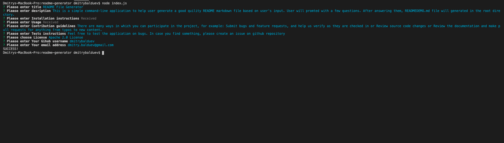
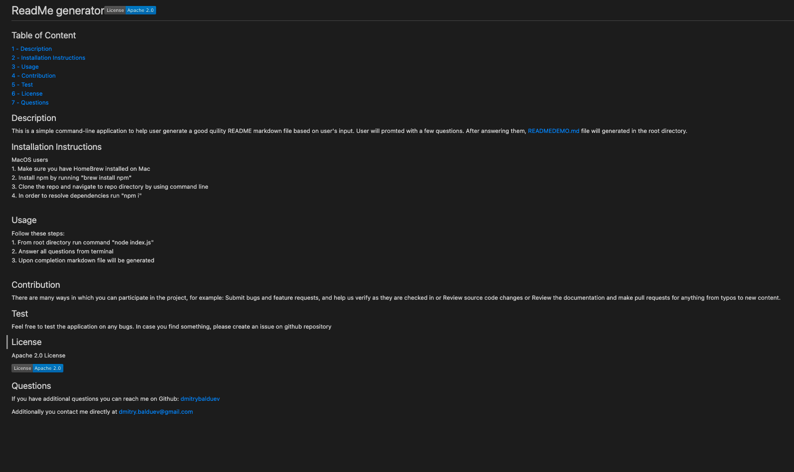

# Readme file generator

## Table of Content
[1 - Description](##Description) 
[2 - Installation Instructions](##Installation-Instructions) 
[3 - Usage](##Usage) 
[4 - Tools](##Tools) 

## Description

This is a simple command-line application to help user generate a good quility README markdown file based on user's input. User will promted with a few questions. After answering them, READMEDEMO.md file will generated in the root directory.

## Installation Instructions

MacOS users:
1. Make sure you have HomeBrew installed on Mac
2. Install npm by running "brew install npm"
3. Clone or download the project and navigate to repository directory by using command line
4. In order to resolve dependencies run "npm i"

## Usage

1. From root directory run command "node index.js" 
2. Answer all questions from terminal. Some questions will be opened in editor mode, (for Mac users it will be vim) in order to start typing press key "i". Upon completion press "ESC" key and ":x!" to exit 
3. When done, markdown file will be generated

Here is short walkthrough video [click here](https://drive.google.com/file/d/1zFuqHi1jakk9LDihK1N3WMOfXYIwyuSL/view)

Here are samples of how command line looks like and sample README file:

## Tools

This application was developed using Node JS. "fs" module was used to interact with file system. "Inquirer" module was used to promt questions on command line. Visual Studio code was used as a IDE. 